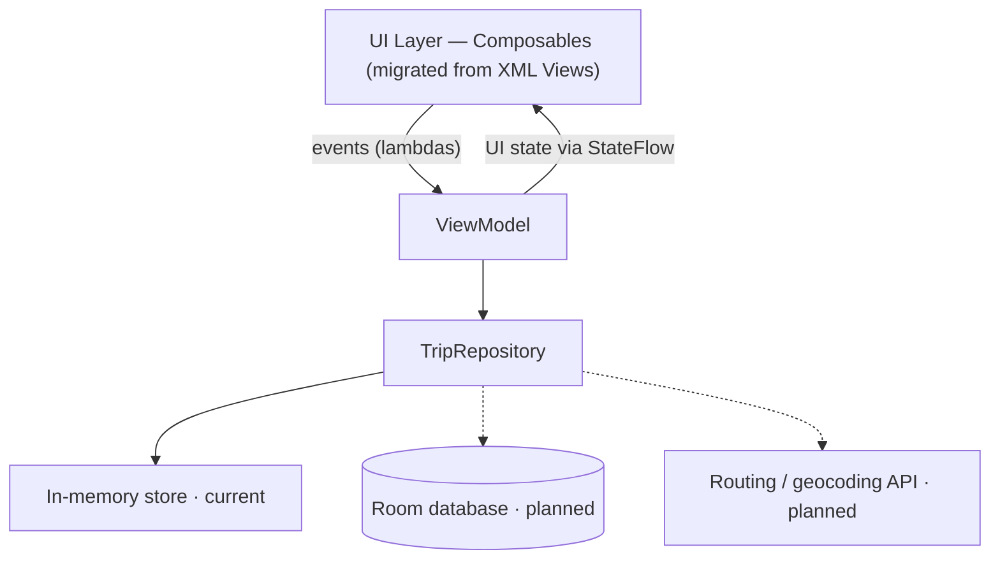

# Architecture

This document explains how Milelog is structured and, more importantly, *why*. The app is deliberately small, so the goal here isn't to justify heavy machinery — it's to show a clean, modern Android architecture that would scale sensibly if the app grew, and to document the reasoning behind each choice.

> **What's implemented vs. planned:** the UI, `ViewModel`, and an in-memory repository are the current foundation. Room, the routing API, and cloud sync are designed-for but not yet built; they're marked *planned* throughout so this document stays accurate as the app evolves.

## Guiding principles

- **Unidirectional data flow (UDF).** State flows down to the UI; events flow up to the `ViewModel`. The UI never mutates state directly — it renders whatever state it's given.
- **Single source of truth.** Each piece of state has exactly one owner. Derived values (like the weekly total) are *computed* from that source, never stored and hand-synced.
- **UI-agnostic core.** The `ViewModel` and data layers know nothing about Compose or Views. This is what makes the migration possible — see below.
- **Deferred complexity.** The hard infrastructure (persistence, networking, sync) sits behind a repository boundary and is added in stages, so early work stays simple and shippable.

## Layers



**UI layer.** Composables render `TripListUiState` / `TripDetailUiState` and emit user events as callback lambdas. State is collected with `collectAsStateWithLifecycle()` so collection respects the lifecycle. Composables are kept stateless where practical (state hoisted to the caller or the `ViewModel`), which makes them previewable and testable in isolation.

**ViewModel.** Holds screen state as an immutable UI-state data class exposed via `StateFlow`. It handles events by updating state and delegating data operations to the repository. It never references an `Activity`, a `View`, or a composable — a constraint that pays off directly in the migration.

**Data layer.** A `TripRepository` is the single entry point for trip data. Today it's backed by an in-memory list; the interface is designed so the backing store can change (to Room, then a synced remote source) without the `ViewModel` or UI knowing.

## Unidirectional data flow

```
User action → event lambda → ViewModel updates state → new StateFlow value → UI recomposes
```

The `ViewModel` exposes read-only `StateFlow`; only the `ViewModel` holds the mutable backing state. The weekly total demonstrates the "derive, don't store" rule: it's produced by transforming the trips flow (group by ISO week, sum distance) rather than being maintained as a separate mutable field, so it can never drift out of sync with the underlying trips.

## The migration strategy (Views/XML → Compose)

This is the core of the project. The app began as a Views/XML implementation and is migrated to Compose **incrementally**, not rewritten in one pass.

The migration is tractable because of a deliberate separation: the `ViewModel`, `StateFlow`, UI-state models, and repository are all UI-toolkit-agnostic. When a screen moves from XML to Compose, **only the UI layer changes** — the state and data plumbing are reused untouched. Concretely:

- **RecyclerView → `LazyColumn`.** The adapter, `ViewHolder`, and `DiffUtil` machinery disappear; the list becomes a function of the trips `StateFlow`. The `ViewModel` feeding it is unchanged.
- **`ComposeView` (Compose inside Views).** New Compose UI is dropped into existing XML screens before those screens are fully converted, so the app stays runnable at every step.
- **`AndroidView` (Views inside Compose).** For any View with no direct Compose equivalent, it's embedded inside a composable rather than blocking the migration.

**Seams handled at the boundary:**
- *Theming.* A shared Material theme so migrated and not-yet-migrated screens stay visually consistent.
- *Lifecycle ownership.* `ComposeView` needs a correct `ViewTreeLifecycleOwner`; state collection uses `collectAsStateWithLifecycle()` so it's lifecycle-aware on both sides of the boundary.
- *State collection.* The same `StateFlow` drives both the legacy and Compose UIs during transition, so there's never a second source of truth.

## State management

- **`ViewModel` state** for anything that must survive configuration changes (the trip list, screen UI state).
- **`remember`** for transient UI-only state that can reset on recomposition.
- **`rememberSaveable`** for transient UI state that should survive rotation but doesn't belong in the `ViewModel` (e.g. an expanded/collapsed toggle).
- **State hoisting** so composables receive state and emit events rather than owning state internally.

## Package structure

<!-- TODO: confirm/adjust once the packages exist. This is the intended layout for the current scope. -->
```
com.[you].milelog
├── ui
│   ├── triplist      // list screen: composable + UI state
│   ├── tripdetail    // detail screen
│   ├── addtrip       // add-trip form
│   └── theme         // Material theme
├── data
│   ├── TripRepository.kt
│   └── model         // Trip and related models
└── MainActivity.kt
```

Package-by-feature within the UI layer keeps each screen's composable and state together. As the app grows (Room, remote), the `data` package gains `local` and `remote` sources behind the existing repository interface.

## Key decisions and trade-offs

**In-memory data first, Room later.** The repository boundary means persistence can be added without touching the UI. Starting in-memory keeps the foundation focused on UI and state; it's explicitly a first stage, not the final design.

**Manually entered distance first, routing API later.** Real road distance requires geocoding plus a routing API — meaningful networking complexity. Deferring it keeps the early app fully functional and avoids coupling core UI work to an external dependency. The distance field is designed to be swapped for a computed value later.

**`StateFlow` over `LiveData`.** `StateFlow` is Kotlin-first, always has a value, composes with Flow operators (used for the weekly total), and pairs cleanly with `collectAsStateWithLifecycle()`.

**Navigation 3.** Chosen as the current recommended navigation approach for new Compose work; the developer-owned, state-based back stack fits a UDF architecture well.

**Incremental migration over rewrite.** Rewriting wholesale would mean a long period with no runnable app and a high regression risk. Incremental migration keeps the app working at every commit and mirrors how real codebases are modernized — which is also the skill this project is meant to demonstrate.

## Testing strategy

<!-- Planned — implement alongside the corresponding features. -->
- **ViewModel / repository:** plain JUnit with a fake repository; use `runTest` and advance the test dispatcher for coroutine/Flow logic.
- **UI:** Compose test rule with semantics matchers for the list, detail, and add-trip flows.
- **Isolation:** fake the data (and later, network/auth) layers so tests don't touch real services.

## How this scales (planned evolution)

The repository boundary is what lets the app grow without churning the UI:

1. **Room** becomes the local source of truth; the repository reads/writes via a DAO and exposes `Flow`. The UI is unaffected.
2. **Routing/geocoding API** is added as a remote source; the repository coordinates it with the local store. Manually entered distance becomes a computed value.
3. **Accounts + sync** layer on an offline-first model — Room stays the source of truth, and a sync process reconciles with the cloud.
